# Bedtime Story Factory — Agent Instructions

You are operating the Bedtime Story Factory, an autonomous pipeline that generates children's bedtime stories while the user sleeps.

## Architecture

This project uses **skill-chaining** — each skill is a plain Markdown file (`SKILL.md`) that any LLM agent can read and execute. No frameworks, no databases, no Docker.

Skills compose into **numbered workflows** that chain into a full production pipeline:

## Workflow Composition

```
Workflow 1: Discovery            /story-research → /story-concept → /originality-check
Workflow 1.5: Bridge             /story-bridge (validates concepts before writing)
Workflow 2: Production           /story-writing (references CRAFT_GUIDE.md)
Workflow 3a: Review              /story-review (craft-focused criteria) OR /story-review-llm
Workflow 3b: Polish              /story-improvement-loop
Workflow 4a: Character           /story-character-bible (anchor images + style lock)
Workflow 4b: Illustration        /story-illustrate (actual image generation with QC)
Workflow 4c: Layout              /story-layout (fixed-layout EPUB + print-ready PDF)
Workflow 4d: Export              /story-export (KDP-compliant, AI disclosure, pricing)
Workflow S: Series               /story-series (multi-book production)
Workflow N: Notify               /story-notify (called throughout)
Workflow A: Analytics            /story-analytics (production dashboard)

Full Pipeline: /story-pipeline   chains 1 → 1.5 → 2 → 3a → 3b → 4a → 4b → 4c → 4d
```



```mermaid
graph LR
    A["/story-research"] --> B["/story-concept"]
    B --> C["/originality-check"]
    C --> D["/story-bridge"]
    D -->|GO| E["/story-writing"]
    D -->|SKIP| C
    E -->|"craft guide"| F["/story-review"]
    F --> G["/story-improvement-loop"]
    G --> CB["/story-character-bible"]
    CB --> H["/story-illustrate"]
    H --> L["/story-layout"]
    L --> I["/story-export"]
    
    style D fill:#f9a825,stroke:#333
    style E fill:#e65100,stroke:#333,color:#fff
    style F fill:#42a5f5,stroke:#333
    style G fill:#42a5f5,stroke:#333
    style CB fill:#ab47bc,stroke:#333,color:#fff
    style H fill:#ab47bc,stroke:#333,color:#fff
    style L fill:#ab47bc,stroke:#333,color:#fff
```

## Quick Commands

| Command | Workflow | What it does |
|---------|----------|-------------|
| `/story-pipeline "theme"` | Full (1→4) | Overnight batch (research→export) |
| `/story-research "niche"` | 1 only | Market research |
| `/story-concept "theme"` | 1 only | Generate concepts |
| `/story-bridge` | 1.5 only | Validate concepts before writing |
| `/story-writing "concept"` | 2 only | Write a single story |
| `/story-review "file.md"` | 3a only | Review and score |
| `/story-review-llm "file.md"` | 3a only | Review via cheap LLM |
| `/story-improvement-loop "file.md"` | 3b only | Multi-round polishing |
| `/story-illustrate "file.md"` | 4 only | Generate illustration prompts |
| `/story-export` | 4 only | EPUB + KDP export |
| `/story-notify "msg"` | Notify | Send LINE push notification |
| `/story-analytics` | Analytics | Production dashboard |

## Key Constants (override inline)

- TARGET_AGE = "3-6"
- WORD_COUNT = 800
- MAX_REVIEW_ROUNDS = 3
- AUTO_PROCEED = true
- REVIEWER_MODEL = "gpt-4o"
- HUMAN_CHECKPOINT = false
- NOTIFICATION_LEVEL = "all" (levels: all / milestones / final)

## Version Tracking

All story files follow a strict versioning convention:

```
stories/{slug}_v0_draft.md       ← First draft from /story-writing
stories/{slug}_v1_reviewed.md    ← After /story-review
stories/{slug}_v2_improved.md    ← After /story-improvement-loop
stories/{slug}_v3_final.md       ← Approved for export
```

**Rules:**
- NEVER overwrite a previous version. Always create the next `_vN_` file.
- Frontmatter must include `version: N` and `previous_version: "filename"`
- The pipeline always operates on the latest version

## State Persistence & Recovery

The pipeline saves state files for crash recovery (critical for overnight runs):

| File | Purpose | Written By |
|------|---------|-----------|
| `PIPELINE_STATE.json` | Current stage + story progress | story-pipeline |
| `REVIEW_STATE.json` | Current review round + score | story-review |
| `IMPROVEMENT_STATE.json` | Current improvement round | story-improvement-loop |
| `PIPELINE_ERRORS.md` | Skipped stories + error log | story-pipeline |

**On startup:** if `PIPELINE_STATE.json` exists with `"status": "in_progress"` AND timestamp < 24h:
1. Resume from saved stage
2. Skip stories that already have output files (idempotent)
3. Continue from first incomplete story

**Error handling:**
- Transient errors → retry 3x with backoff
- Story-specific errors → skip and continue
- Fatal errors → save state, send notification, halt

## Human Checkpoints

When `HUMAN_CHECKPOINT = true`, review skills pause for user input:

| Response | Action |
|----------|--------|
| `go` | Implement all suggested fixes |
| `skip N` | Skip fix #N, implement rest |
| `stop` | Save state, halt (resume later) |
| `custom: ...` | Use custom instructions instead |

When `HUMAN_CHECKPOINT = false` (default): auto-proceed with all fixes.

## Notifications

`/story-notify` sends LINE Notify push notifications at each stage. Requires `LINE_NOTIFY_TOKEN` env var. Fallback: logs to `NOTIFICATION_LOG.md`.

## Safety Rules

- All stories must end peacefully (bedtime!)
- No violence, scary elements, or anxiety-inducing content
- Vocabulary must match target age group
- Cross-model review prevents quality blind spots
- Flesch-Kincaid scoring ensures readability

## File Structure

```
bedtime-story-factory/
├── CLAUDE.md              ← You are here (agent instructions)
├── skills/                ← 13 SKILL.md files (the brain)
│   ├── story-research/        Workflow 1: market research
│   ├── story-concept/         Workflow 1: concept generation
│   ├── originality-check/     Workflow 1: deduplication
│   ├── story-bridge/          Workflow 1.5: concept validation
│   ├── story-writing/         Workflow 2: full story generation
│   ├── story-review/          Workflow 3a: autonomous review
│   ├── story-review-llm/      Workflow 3a: cheap LLM review
│   ├── story-improvement-loop/ Workflow 3b: prose polishing
│   ├── story-illustrate/      Workflow 4: illustration prompts
│   ├── story-export/          Workflow 4: EPUB + KDP
│   ├── story-notify/          LINE push notifications
│   ├── story-analytics/       Production dashboard
│   └── story-pipeline/        Full overnight orchestrator
├── mcp-servers/           ← MCP server implementations
│   ├── llm-chat/              Cross-model review
│   └── line-notify/           LINE Notify API
├── styles/                ← EPUB stylesheets
│   └── children-book.css      Children's book layout
├── stories/               ← Generated stories (versioned)
├── illustrations/         ← Midjourney prompts per story
├── output/                ← Final exports
│   └── approved/              Stories that passed review
└── docs/                  ← Guides
    ├── SETUP.md               Getting started
    ├── LLM_PROVIDERS.md       Model comparison + costs
    ├── WORKFLOW_DIAGRAM.md    Visual pipeline diagrams
    └── NARRATIVE_REPORT_EXAMPLE.md  Sample full run
```

## Score Progression Tracking

Each story's review history is tracked in `SCORE_TRACKER.md`:

```markdown
## Score Progression: "Brave Little Dragon"

| Round | Time | Age | Arc | Read | Engage | Moral | Illust | Parent | Bedtime | Overall | Δ |
|-------|------|-----|-----|------|--------|-------|--------|--------|---------|---------|---|
| R0 draft | 22:15 | 6 | 5 | 7 | 6 | 5 | 7 | 6 | 4 | 5.8 | — |
| R1 review | 22:30 | 8 | 7 | 8 | 7 | 7 | 8 | 7 | 7 | 7.4 | +1.6 |
| R2 improve | 22:45 | 9 | 9 | 9 | 8 | 8 | 9 | 8 | 9 | 8.6 | +1.2 |
```

This enables overnight batch analysis: which stories improved most, which criteria are consistently weak, and where to focus future writing prompts.

## Production At a Glance

```
Skills:     13 (12 story skills + 1 analytics)
MCP servers: 2 (llm-chat + line-notify)
Docs:        4 guides
Styles:      1 EPUB stylesheet
Pipeline:    8 stages, overnight-ready
Recovery:    state files + idempotent stage checks
Monitoring:  LINE Notify + NOTIFICATION_LOG.md
```
