# Bedtime Story Factory — Agent Instructions

You are operating the Bedtime Story Factory, an autonomous pipeline that generates children's bedtime stories while the user sleeps.

## Architecture

This project uses **skill-chaining** — each skill is a plain Markdown file (`SKILL.md`) that any LLM agent can read and execute. No frameworks, no databases, no Docker.

Skills compose into **numbered workflows** that chain into a full production pipeline:

## Workflow Composition

```
Workflow 1: Discovery            /story-research → /story-concept → /originality-check
Workflow 1.5: Bridge             /story-bridge (validates concepts before writing)
Workflow 2: Production           /story-writing (batch, one per concept)
Workflow 3: Quality              /story-review → /story-improvement-loop
Workflow 4: Output               /story-illustrate → /story-export

Full Pipeline: /story-pipeline   chains Workflow 1 → 1.5 → 2 → 3 → 4
```



```mermaid
graph LR
    A["/story-research"] --> B["/story-concept"]
    B --> C["/originality-check"]
    C --> D["/story-bridge"]
    D -->|GO| E["/story-writing"]
    D -->|SKIP| C
    E --> F["/story-review"]
    F --> G["/story-improvement-loop"]
    G --> H["/story-illustrate"]
    H --> I["/story-export"]
    
    style D fill:#f9a825,stroke:#333
    style F fill:#42a5f5,stroke:#333
    style G fill:#42a5f5,stroke:#333
```

## Quick Commands

| Command | Workflow | What it does |
|---------|----------|-------------|
| `/story-pipeline "theme"` | Full (1→4) | Overnight batch (research→export) |
| `/story-research "niche"` | 1 only | Market research |
| `/story-concept "theme"` | 1 only | Generate concepts |
| `/story-bridge` | 1.5 only | Validate concepts before writing |
| `/story-writing "concept"` | 2 only | Write a single story |
| `/story-review "file.md"` | 3 only | Review and score |
| `/story-review-llm "file.md"` | 3 only | Review via cheap LLM |
| `/story-improvement-loop "file.md"` | 3 only | Multi-round polishing |
| `/story-illustrate "file.md"` | 4 only | Generate illustration prompts |
| `/story-export` | 4 only | EPUB + KDP export |

## Key Constants (override inline)

- TARGET_AGE = "3-6"
- WORD_COUNT = 800
- MAX_REVIEW_ROUNDS = 3
- AUTO_PROCEED = true
- REVIEWER_MODEL = "gpt-4o"
- HUMAN_CHECKPOINT = false

## Version Tracking

All story files follow a strict versioning convention:

```
stories/{slug}_v0_draft.md       ← First draft from /story-writing
stories/{slug}_v1_reviewed.md    ← After /story-review
stories/{slug}_v2_improved.md    ← After /story-improvement-loop
stories/{slug}_v3_final.md       ← Approved for export
```

**Rules:**
- NEVER overwrite a previous version. Always create the next `_vN_` file.
- Frontmatter must include `version: N` and `previous_version: "filename"`
- The pipeline always operates on the latest version

## State Persistence

The pipeline saves `PIPELINE_STATE.json` after each stage for crash recovery:

```json
{
  "pipeline_id": "batch-20260319",
  "current_stage": 4,
  "current_story_index": 3,
  "total_stories": 10,
  "status": "in_progress",
  "started_at": "2026-03-19T22:00:00",
  "last_updated": "2026-03-19T23:15:00",
  "stage_results": {
    "1_research": "complete",
    "2_concepts": "complete",
    "3_originality": "complete",
    "4_writing": "in_progress"
  }
}
```

On startup: if `PIPELINE_STATE.json` exists with `"status": "in_progress"` AND timestamp < 24h, resume from saved stage.

## Safety Rules

- All stories must end peacefully (bedtime!)
- No violence, scary elements, or anxiety-inducing content
- Vocabulary must match target age group
- Cross-model review prevents quality blind spots
- Flesch-Kincaid scoring ensures readability

## File Structure

```
skills/          → SKILL.md files (the brain)
stories/         → Generated story markdown files (versioned: _v0_, _v1_, _v2_)
illustrations/   → Midjourney prompts per story
output/          → Final exports (EPUB, PDF)
output/approved/ → Stories that passed review
mcp-servers/     → MCP server implementations
docs/            → Setup guides and documentation
```

## Score Progression Tracking

Each story's review history is tracked in `SCORE_TRACKER.md`:

```markdown
## Score Progression: "Brave Little Dragon"

| Round | Time | Age | Arc | Read | Engage | Moral | Illust | Parent | Bedtime | Overall | Δ |
|-------|------|-----|-----|------|--------|-------|--------|--------|---------|---------|---|
| R0 draft | 22:15 | 6 | 5 | 7 | 6 | 5 | 7 | 6 | 4 | 5.8 | — |
| R1 review | 22:30 | 8 | 7 | 8 | 7 | 7 | 8 | 7 | 7 | 7.4 | +1.6 |
| R2 improve | 22:45 | 9 | 9 | 9 | 8 | 8 | 9 | 8 | 9 | 8.6 | +1.2 |
```

This enables overnight batch analysis: which stories improved most, which criteria are consistently weak, and where to focus future writing prompts.
