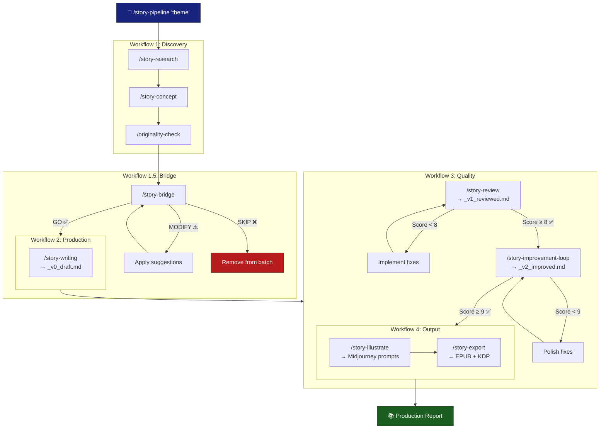
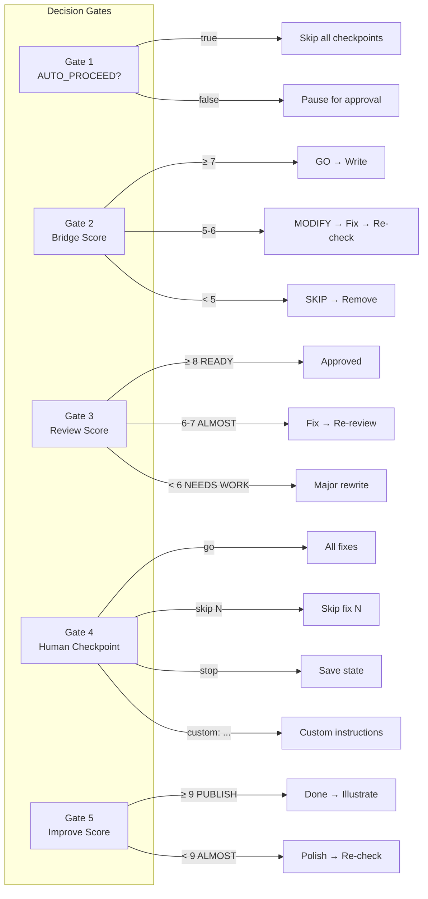
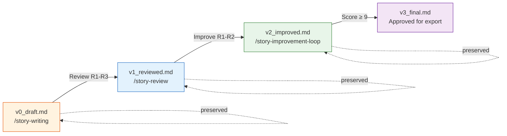
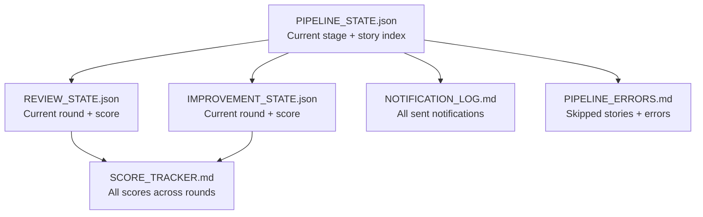

# 🔄 Workflow Diagram — Full Pipeline

## Overview



## Decision Points



## Version Flow



## State Files



## Timing (10 story batch)

```
22:00 ─── START ────────────────────────────────────────────
22:05 ─── Research + Concepts (Workflow 1) ─────────────────
22:10 ─── Originality Check ────────────────────────────────
22:15 ─── Bridge Validation (Workflow 1.5) ─────────────────
      │
22:15 ─── Writing Story 1 ─────────────┐
22:20 ─── Writing Story 2              │
22:25 ─── Writing Story 3              │ Workflow 2
22:30 ─── ...                          │ (batch)
23:00 ─── Writing Story 10 ────────────┘
      │
23:00 ─── Review Story 1 (R1→R2→R3) ──┐
23:10 ─── Review Story 2               │
23:20 ─── ...                          │ Workflow 3a
01:00 ─── Review Story 10 ─────────────┘
      │
01:00 ─── Improve Story 1 (R1→R2) ────┐
01:05 ─── Improve Story 2             │ Workflow 3b
01:10 ─── ...                          │ (skip if ≥9)
01:50 ─── Improve Story 7 ─────────────┘
      │
01:50 ─── Illustrate (batch) ──────────  Workflow 4
02:20 ─── Export (batch) ──────────────
02:25 ─── COMPLETE ─────────────────────────────────────────
```
